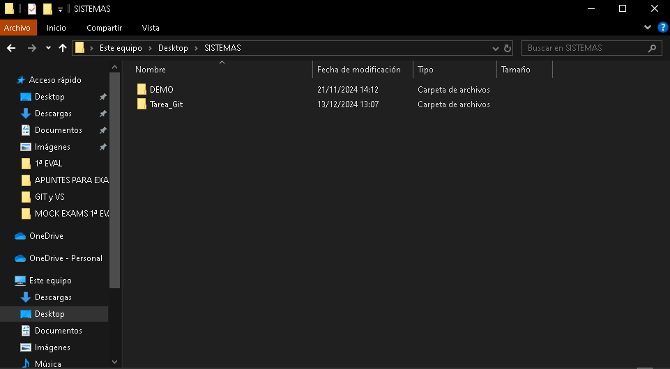

# Pasos de la tarea acompañados de sus respectivas screenshots:
### CREACIÓN DE LA CARPETA DEL PROYECTO LLAMADA “Tarea_Git”:

### CREACIÓN DEL REPOSITORIO EN LA CARPETA DEL PROYECTO:

### AHORA CREAMOS EL ARCHIVO MARKDOWN README.md (CON ÚNICAMENTE LA DESCRIPCIÓN DE UNOS CUANTOS PASOS DE LA 
### TAREA):

### NECESITAMOS MOVER ESE ARCHIVO AL ÁREA DE PREPARACIÓN CON EL COMANDO "git add README.md" dentro del
directorio:

### DESPUÉS VEMOS CON "git status" QUE EL ARCHIVO ESTÁ EN EL ÁREA DE PREPARACIÓN Y QUE PODEMOS HACER NUESTRO
### PRIMER COMMIT (AL ESTAR EN VERDE NOS LO INDICA):

### AHORA VAMOS A REALIZAR UN CAMBIO EN EL ARCHIVO (AÑADIENDO ALGUNAS CAPTURAS DE PANTALLA) Y LUEGO HAREMOS UN
### SEGUNDO COMMIT:

### BIEN, AHORA NOS QUEDA HACER UN TERCER COMMIT CON TODAS LAS CAPTURAS DE PANTALLA Y FIRMAR AL FINAL DE ESTE ARCHIVO.

### HAY QUE ENTENDER QUE ESTA CAPTURA ES DE CÓMO SE REALIZARÍA, AÚN NO SE HA HECHO LA CAPTURA DE PANTALLA YA QUE
### CUANDO SE HAGA ESE COMMIT AÚN NO TENDRÁ REALMENTE LA CAPTURA AÑADIDA A ESTE ARCHIVO. PERO AL FIN Y AL CABO
### SE VERÁ EN EL REPOSITORIO QUE ESTE ES EL TERCER Y ÚLTIMO COMMIT CON TODAS LAS CAPTURAS DE PANTALLA.

### COMMIT EXTRA CON UNA CAPTURA DE LOS TRES COMMITS ANTERIORES:

### FIRMA: ELENA
